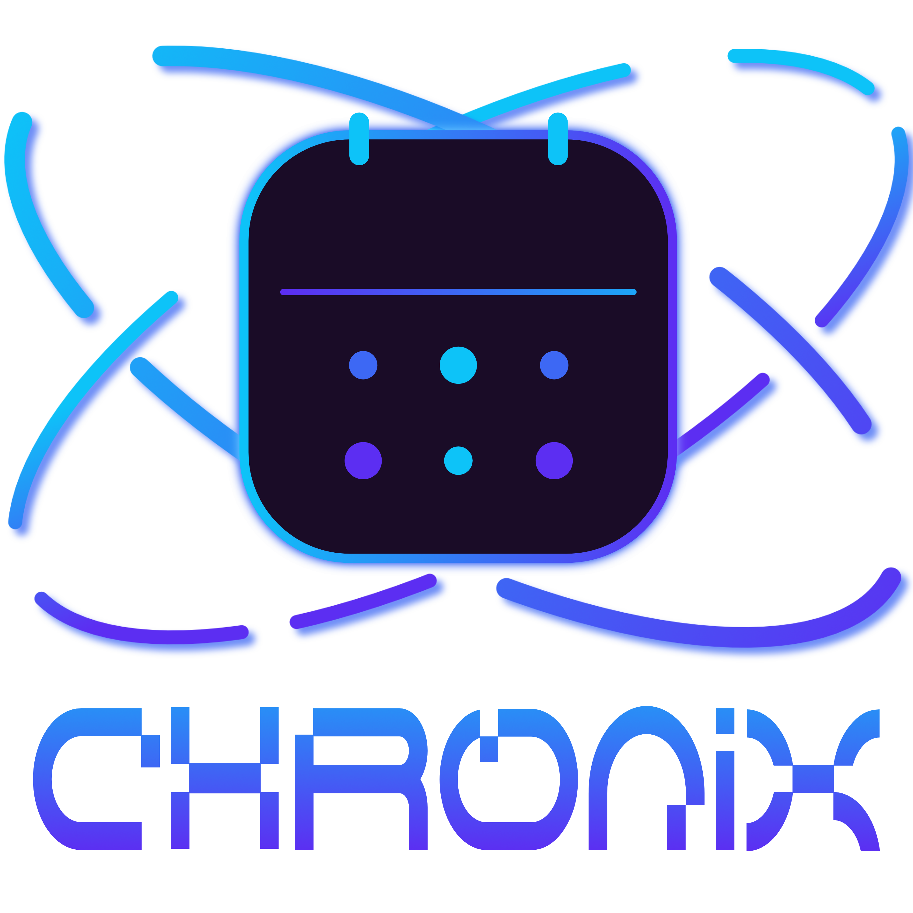

  

  # Chronix

  **Die ultimative Kalender- und Timeline-Engine für Worldbuilder, Fantasy- & Sci-Fi-Autoren**

---

**Chronix** ist eine leistungsstarke, eigenständige Desktop-Anwendung, die speziell für die Bedürfnisse von Autoren, Rollenspielern und Worldbuildern entwickelt wurde. Sie ermöglicht es, völlig freie, hierarchische Kalender- und Zeitsysteme von Grund auf neu zu erfinden und komplexe Story-Timelines über mehrere Planeten hinweg synchron zu verwalten.

Verabschieden Sie sich von den starren Grenzen herkömmlicher 24-Stunden-Kalender!

---

## 🌟 Hauptfunktionen

### ⏳ Vollständig freie Zeitarchitektur
Kreieren Sie Zeit- und Kalendersysteme, die perfekt zu Ihrer Welt passen. Die Engine zwingt Ihnen keine 24 Stunden oder 60 Minuten auf.
*   **Dezimalzeit?** 10 Stunden à 100 Minuten.
*   **Fantasy-Zeit?** 4 Wachen à 6 Glockenschläge.
*   **Sci-Fi-Zeit?** Takte und Pulse.
Sie definieren Ihre eigenen Zeiteinheiten und die Software berechnet den Rest.

### 🌌 Multi-Planeten-Synchronisation
Schreiben Sie ein episches Sci-Fi-Abenteuer? Legen Sie für jeden Planeten eigene Tages- und Jahreslängen fest. Chronix berechnet und synchronisiert jeden Zeitpunkt automatisch. Wenn auf Planet A der "45. Tag der 3. Wache" anbricht, zeigt Ihnen Chronix mit einem Klick exakt an, wie spät es im selben Moment auf Planet B ist.

### 📅 Epochen, Monate & Feiertage
Bauen Sie Ihren Kalender exakt nach Ihren Vorstellungen:
*   **Zeitalter:** Definieren Sie Ären (z. B. "Vor dem Fall", "Das 3. Zeitalter").
*   **Monate & Jahreszeiten:** Beliebige Anzahl, individuelle Längen und eigene Farben zur visuellen Hervorhebung im Kalender.
*   **Feiertage & Schalttage:** Platzieren Sie Feste fest in Monaten oder völlig unabhängig von der regulären Wochentagszählung ("Interkalartage").
*   **Schaltregeln:** Definieren Sie hochkomplexe Ausnahmen (z.B. "Füge alle 4 Jahre einen Tag hinzu, außer alle 100 Jahre").

### 🌘 Astronomie-System (Sonnen & Monde)
Erwecken Sie den Himmel Ihrer Welten zum Leben.
*   Definieren Sie mehrere Sonnen (z. B. für Binärsysteme) mit eigenen Auf- und Untergangszeiten.
*   Erstellen Sie beliebig viele Monde mit individuellen Umlaufzeiten. Chronix berechnet automatisch für jeden Tag die korrekte Mondphase und zeigt diese grafisch im Kalender an.

### 📖 Story-Tracker & Live-Suche
Chronix ist nicht nur ein Kalender-Editor, sondern ein mächtiges Werkzeug zur Story-Planung:
*   Generieren Sie eine wunderschöne, interaktive Matrix Ihres Kalenders.
*   Fügen Sie Ereignisse (Events) hinzu und verknüpfen Sie diese mit Charakteren, Orten und Handlungssträngen.
*   Finden Sie Handlungsorte und Charaktere in Sekundenbruchteilen über die **Live-Suche**. Die entsprechenden Tage leuchten im Kalender sofort auf!

---

## 🚀 Erste Schritte

Chronix ist darauf ausgelegt, intuitiv und visuell ansprechend zu sein. Die Anwendung ist in zwei Hauptbereiche unterteilt:

1.  **🛠️ Welten- & Zeit-Editor:** Hier definieren Sie die grundlegenden Regeln Ihrer Welt. Legen Sie Planeten an, erstellen Sie Ihre Zeiteinheiten, Monate, Feiertage und astronomische Himmelskörper. Speichern Sie Ihre Projekte als `.worldcal`-Dateien.
2.  **📅 Kalender-Viewer:** Mit einem Klick auf *Kalender generieren* wechseln Sie in die interaktive Ansicht. Hier durchstöbern Sie die Tage, fügen Story-Events hinzu, prüfen Mondphasen und durchsuchen Ihre Timeline.

*Chronix - Bringen Sie Ordnung in die Geschichte Ihrer Welten.*
